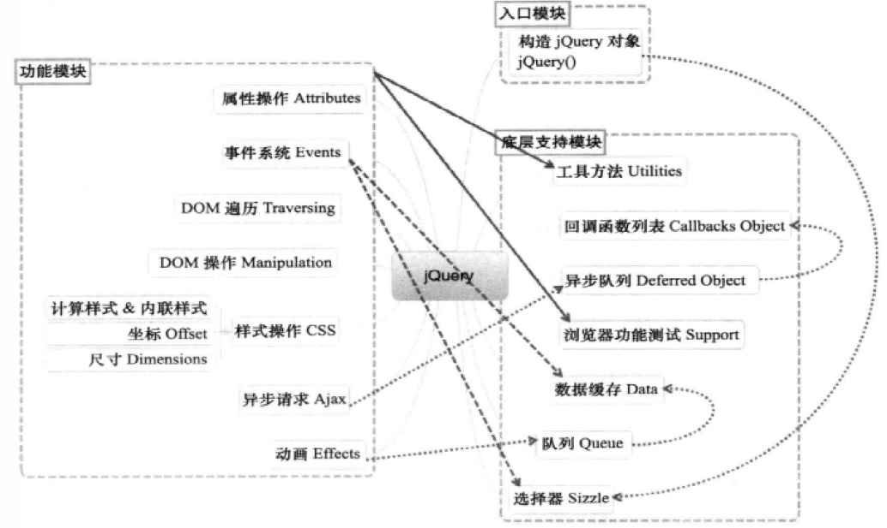
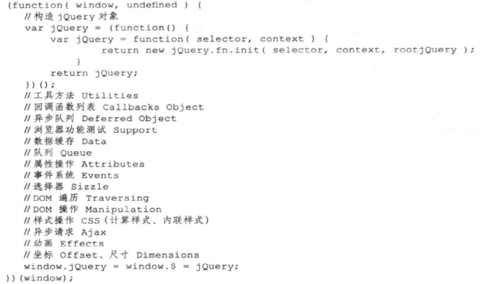

analyzejquery(based on version 2.0.3)

#### design philosophy
1. cross-browser
2. chain style
3. flexible css selector, can extend
4. plugin

#### What I have learned :
1. no new constructor
2. chain invoke
3. plugin for extension
